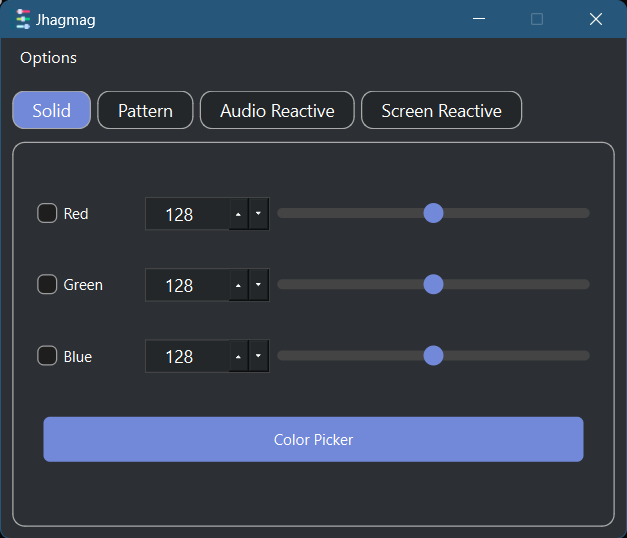

# Jhagmag LED Controller

**Jhagmag** is an Arduino-based LED controller designed for vibrant, customizable lighting effects. Utilizing an HC-05 Bluetooth module and optional push-button functionality, it offers control over a variety of LED patterns and effects. A Python GUI, developed with PyQt6, provides an intuitive interface for adjusting patterns, colors, and settings. For enhanced portability and durability, the hardware is assembled on a dot matrix board and enclosed in a custom housing.

## Table of Contents

- [Features](#features)
- [Hardware Requirements](#hardware-requirements)
- [Software Requirements](#software-requirements)
- [Project Structure](#project-structure)
- [Pictures](#pictures)
- [Videos](#videos)
- [Arduino Schematic](#arduino-schematic)
- [Contributors](#contributors)
- [Acknowledgments](#acknowledgments)
- [License](#license)

---

## Features

- **Control Mechanisms**:
  - **Bluetooth Control**: Adjust patterns and settings via an HC-05 Bluetooth module.
  - **Push Button**: Offline pattern swapping without Bluetooth connectivity.
- **LED Patterns**:
  - Solid
  - Fade
  - Cycle
  - Rainbow Cycle
  - Breathing
  - Random
- **Advanced Features**:
  - Real-time **audio visualization** with LEDs responding dynamically to sound.
  - **Screen color detection**: Sync LEDs with the predominant screen color.
- **Graphical Interface**:
  - Built with **PyQt6** for cross-platform compatibility and intuitive controls.
  - Integrated **settings window** for serial connection configuration.
- **Compact Design**:
  - Circuit assembled on a **dot matrix board** for reliability.
  - Enclosed in a **custom housing** for a polished, portable setup.

---

## Hardware Requirements

- **Core Components**:
  - Arduino board (e.g., Arduino Uno)
  - HC-05 Bluetooth module
  - RGB LED strip
  - Push button (for pattern swapping)
- **Electronics**:
  - Resistors:
    - 3 x 200Ω (current limiting for LED channels)
    - 3 x 10kΩ (MOSFET gate pull-downs)
  - 3 x IRFZ44N MOSFETs (to control RGB LED channels)
  - Blue LED (power/on indicator)
- **Assembly**:
  - Dot matrix board for permanent wiring.
  - Custom box enclosure for protection and portability.

---

## Software Requirements

Ensure the following dependencies are installed before running the software:

- Python 3.6+
- [PyQt6](https://pypi.org/project/PyQt6/) (GUI development)
- [PyAudio](https://pypi.org/project/PyAudio/) (audio processing)
- [Librosa](https://librosa.org/) (audio analysis)
- [Matplotlib](https://matplotlib.org/) (visualization)
- [scikit-learn](https://scikit-learn.org/) (machine learning utilities)
- [Pillow](https://pillow.readthedocs.io/) (image processing)
- [PySerial](https://pypi.org/project/pyserial/) (serial communication)

---

## Project Structure

```
jhagmag-led-controller/
├── Jhagmag/
│   ├── Jhagmag.ino                   # Arduino sketch for LED control
├── modules/
│   ├── __init__.py
│   ├── serial_connection.py          # Serial connection handling
│   ├── audio_visualizer.py           # Audio visualization logic
│   ├── screen_responsive.py          # Screen color detection logic
├── main.py                           # Main PyQt6 GUI application
├── style.qss                         # Stylesheet for the PyQt6 application
└── README.md                         # Project documentation
```

---

## Pictures

<div style="display: flex; flex-wrap: wrap;">
  
  
  
  
  
  
  
</div>

---

## Videos

<a href="https://youtu.be/UNQXKmhpDMk" target="_blank">
  
</a>

> **Note**: Right-click and select "Open link in new tab" for better viewing.

---

## Arduino Schematic

The schematic details the connections between the HC-05 Bluetooth module, push button, RGB LED strip, and MOSFETs. Resistors ensure proper operation and safety, while the blue LED serves as an indicator.

- **Fritzing File**: Download the complete schematic in Fritzing format [here](assets/schematics/jhagmag.fzz).


---

Here's the updated **Contributors** section with specific roles for hardware and software parts:

---

## Contributors

Thanks to these wonderful contributors for their efforts in making this project a success:

<table>
  <tr>
    <td align="center">
      <a href="https://github.com/N00BSC00B">
        
        <br />
        <sub><b>Sayan Barma</b></sub>
      </a>
      <br />
      <b>Software Development</b><br />
      (Software and GUI Development)
    </td>
    <td align="center">
      <a href="https://github.com/TheFastest599">
        
        <br />
        <sub><b>Anirban Saha</b></sub>
      </a>
      <br />
      <b>Hardware Design</b><br />
      (Hardware Design and Assembly)
    </td>
  </tr>
</table>

---

## Acknowledgments

Special thanks to open-source communities and contributors for tools and libraries like PyQt6, Librosa, and Fritzing.

---

## License

This project is licensed under the MIT License. See the [LICENSE](LICENSE) file for details.
